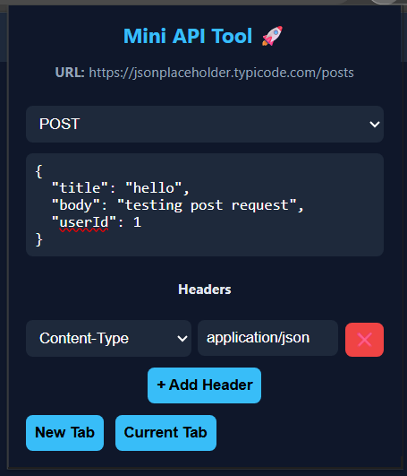
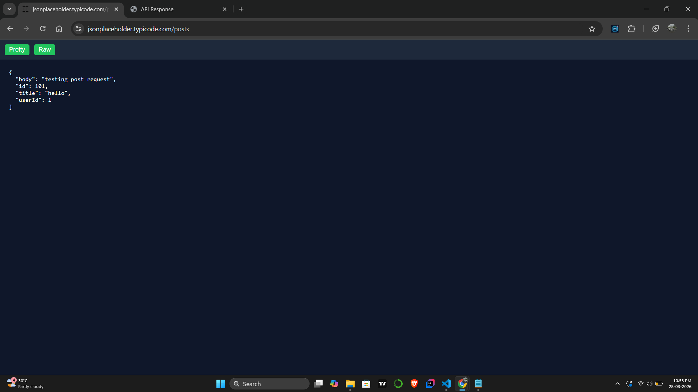

# 🚀 Mini API Tool – Browser Extension

A lightweight Chrome browser extension for testing REST APIs directly from the browser.

This tool allows developers to quickly send HTTP requests and inspect responses without leaving the current webpage.

---

## ✨ Features

- Send HTTP requests directly from your browser
- Supports **GET, POST, PUT, PATCH, DELETE**
- Add **custom headers**
- JSON request body editor
- Pretty / Raw response viewer
- Copy API response to clipboard
- Open response in **New Tab** or **Current Tab**

---

## 📸 Screenshots

### Extension Popup


### API Response Viewer


---

## ⚙️ Installation

Since this extension is not yet published on the Chrome Web Store, you can install it manually.

### Step 1 – Clone the repository

```bash
git clone https://github.com/Ameer114/API-Testing-Browser-Extension.git
```

### Step 2 – Open Chrome Extensions

Open Chrome and go to:

```
chrome://extensions
```

### Step 3 – Enable Developer Mode

Turn on **Developer Mode** in the top-right corner.

### Step 4 – Load the extension

Click **Load unpacked** and select the project folder.

---

## 🧪 Example Usage

### Example POST request

**URL**

```
https://jsonplaceholder.typicode.com/posts
```

**Header**

```
Content-Type : application/json
```

**Body**

```json
{
  "title": "hello",
  "body": "testing post request",
  "userId": 1
}
```

---

## 🛠 Tech Stack

- React
- JavaScript
- Chrome Extension Manifest v3
- HTML / CSS

---

## 📂 Project Structure

```
API-Testing-Browser-Extension
│
├── dist
│   └── index.html
│
├── icons
│   ├── icon16.png
│   ├── icon32.png
│   ├── icon48.png
│   └── icon128.png
│
├── src
│   └── React popup UI
│
├── background.js
├── manifest.json
└── README.md
```

---

## 🔮 Future Improvements

- Request history
- JSON syntax highlighting
- Response status & timing display
- Body type support (Form Data / URL Encoded)
- API request interception

---

## 👨‍💻 Author

**Ameer**

GitHub:  
https://github.com/Ameer114

---

## ⭐ Support

If you like this project, consider giving it a **star ⭐ on GitHub**.
